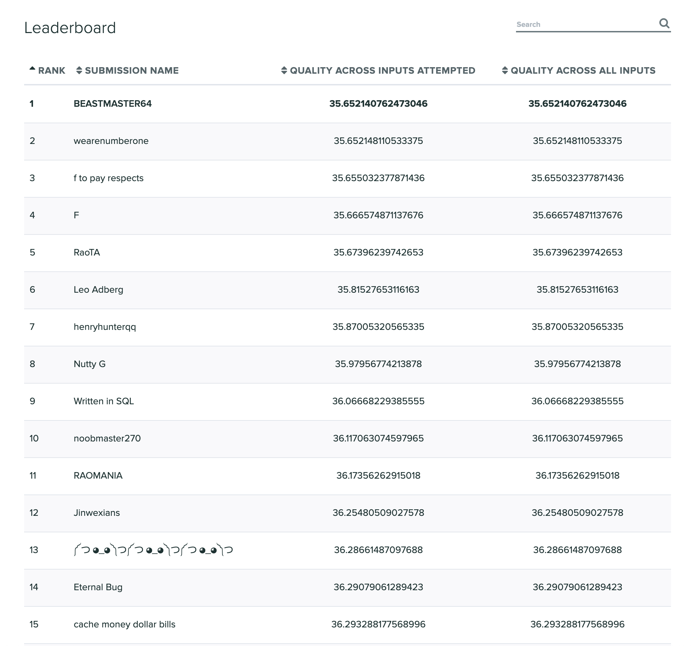
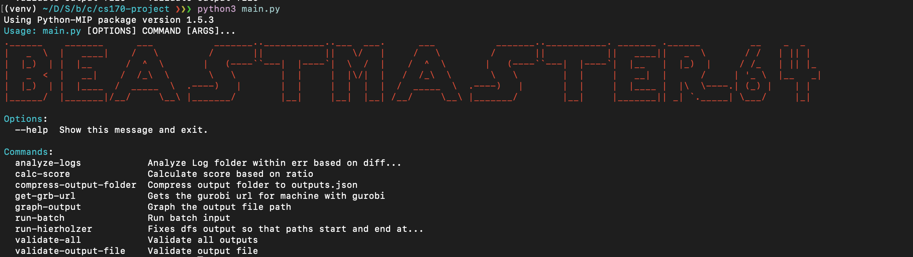

# CS 170 Fall 2019 Project
## Team - BeastMaster64
Vikranth Srivatsa, Rohan Koodli, Bhuvan Basireddy

## Problem Statement
Given a graph that satisfies the triangle inequality, a start vertex, and list of houses, devise a cycle that drops off everyone such that total cost of everyone walking back to their house and the cost of the car visiting vertices is minimized.

The full spec: [Drive the TAs Home](spec.pdf)

## Results
#1 out of 366 teams in our project.




## Approach
We attempted to solve this NP-complete problem similiar to the Traveling Salesman Problem (TSP) using linear programming (LP).

## Creating Custom Inputs/Outputs 
We generate inputs and outputs randomly. Then, we place the TA locations randomly through the graph.
We run a solver through the graph and time it. The graphs that take the longest to solve are the ones provided as input.

## Linear Programming Approach
We aim to solve the problem mainly through integer linear programming (ILP). We use the following given components of our LP: shortest path between all nodes and the distance between vertex i and j.

We define the variable x[i][j] as an indicator variable to be 1 if the car takes the route and 0 if the car doesn't take the route. Since we want to make sure that the source vertex makes a round trip we ensure that for each vertex the sum of x[i][j] of incoming is equal to the sum of outgoing edges.

To handle a TA walking home, we define TA[i][b] as an indicator variable to be 1 if TA i was dropped off at vertex b and 0 otherwise. For each of the TAs, we set the sum of all potential dropoff locations to be 1, to ensure the TA is dropped off exactly once. We also check that any drop off location is upper bounded by the number of cars that visit the vertex to make sure that TAs only get dropped off on the car’s path.

The next part handles eliminating subtours via a modified version of the single commodity flow (SCF) algorithm. We define C[i][j] as an integer that represents the amount of flow on an edge. For every vertex, we say that the sum of the flow of the in edges - sum flow out = number TAs dropped off at vertex. This is prevent local cycles as flow is discounted whenever a TA is dropped off. We set the flow flowing out of source to be total flow, which is the number of TAs to drop off.

Our objective function to minimze energy: 

<!-- Latex above is the rul encoded form of the below -->
<!-- encode at https://www.codecogs.com/latex/eqneditor.php and render image at https://latex.codecogs.com/gif.latex? -->
<!-- \min \frac{2}{3} * \sum_{(u,v) \forall edges} x_{ij} * d_{ij} + 1 * \sum_{i \in TA} \sum_{v \in V} T[i][v] * ShortestPath(v, i) -->


# Running the Code

## Setting up your environment
Create a virtualenv in python and install the requirements using the following command
```sh
pip3 install -r requirements.txt
```

## Choosing a LP solver
There are two solvers that you can use while running the project.

You can either use the open source CBC optimizer or the Gurobi optimizer.

The Gurobi optimizer is a commercial product that is freely available for academic use. 

If you wish to use this optimizer, please go to the website and sign up for an account and active your Gurobi account and license.

There are instructions at `cloudinstructions.sh`.

## Running the solver
The solver can be run using the CLI.



```sh
python3 main.py run-batch --extensions '["50", "100", "200"]' --input-range '[1,1]'
``` 
The other extensions avaiable are `time_limit`, `input_folder`, and `output_folder`.

It can also be run by running the `input_generator.py` file.